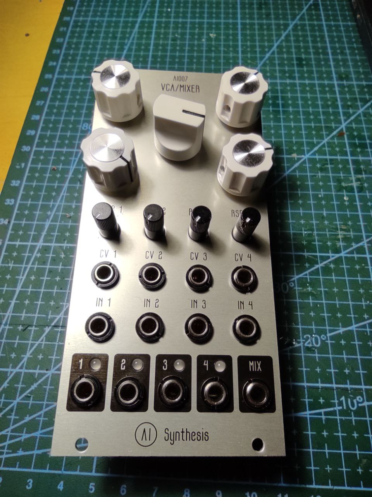
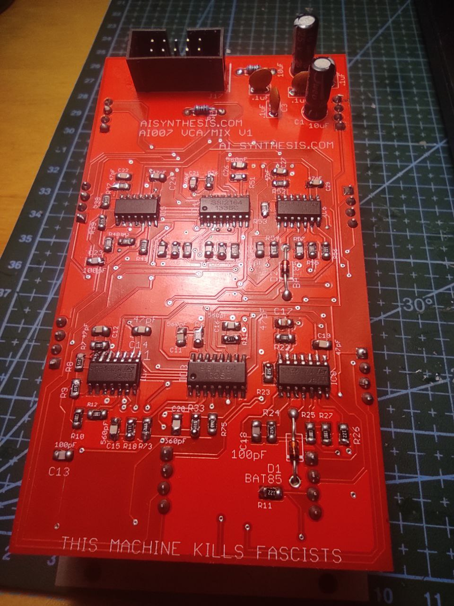
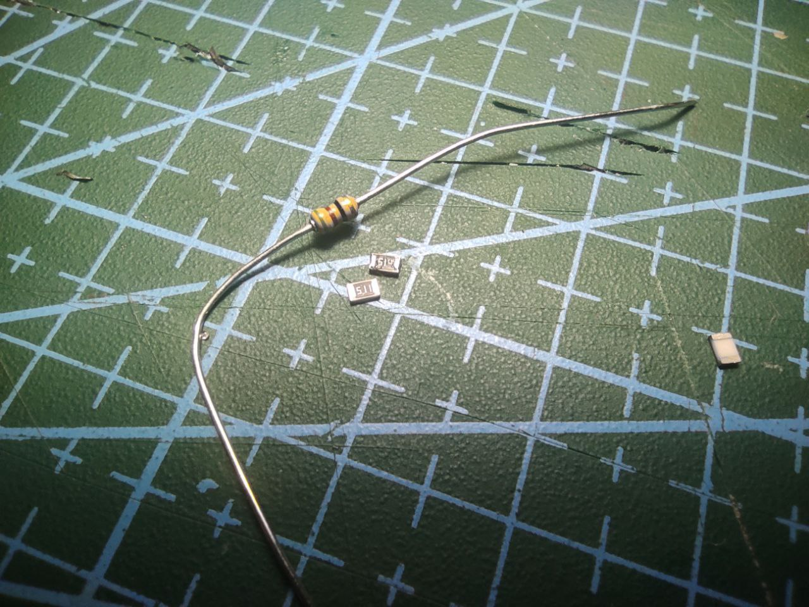

Amazing AI Synthesis creates simple, beginner-friendly, beautiful modules and DIY kits which are thoroughly documented and well-designed. I assembled several of those some time before, and now it was time for their most complicated product - Quad VCA, which is completely smd and quite dense.

Actually it is a fix. I assebled module a year ago and didnt manage to successfully run it. Didn't have enough experience with smd to reflow it - so it appeared in the shelf. Now, with my new abilities and ideas, i finally decided to fix it. 

### Problem

This is it: dense smd board, 6 ics (4 tl074 and 2 SSI2164, which are actually VCAs). I started by reflowing all ics. It's much simpler to do that using rose alloy - i find this method easiest. I have a fan but i all the time worried about burning ics with it..

Anyway, this didn't help. So i started to check other components and i find...
That i ordered and soldered 14 510kOhm resistors instead of 510Ohm ones. What a shame. I found my order in mail - yes, i did that mistake at order stage.
most of resistors were asy to desolder, but part of them... I had to desolder some jacks...

### Conclusion

It is really easy to make mistake anywhere, and really had no idea what to check next, especially if board is big and dense. Check it! Especially with smd, which can be hard to desolder. Check nominals!

