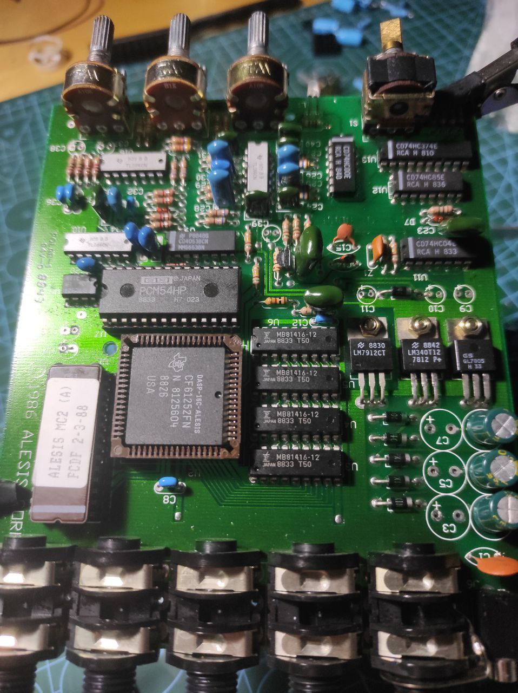
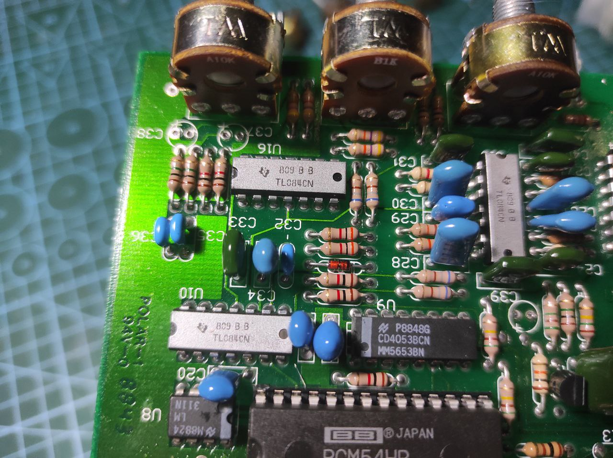
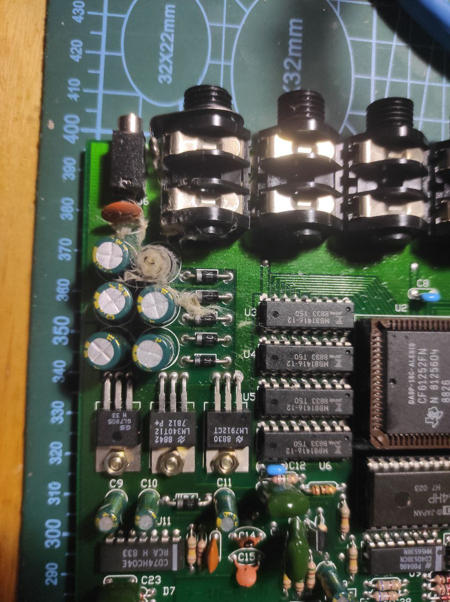

Had this for a while, bought without power supply. Ordered one and check - LED whorks ugly, loud crackles and hisses when moving pots, definitely worth changing it first. Allrighty, lets open it.

### Visual

I like the complexity colors, quality of build, everything about this board. Says 1986, assebled in Korea - and loots amazingly cool. But lets start. After some visual inspection, i also decded to change all electrolitic capacitors due to its age: fourty years straight

Cool! My first capacitor boom. I still have no idea why, but power capacitor bursted (replaced one). Polarity is correct, capacity and voltage is the same. Weird, but seems that old japan ones are a bit better in terms of holding correct voltage. Replaced with 50v instead of 25v.

Also replaced potentiometers. Due to different shaft, i had to change original pot caps. Bad but it worth it, because

### It works
No issues, works like a charm. Sound is a bit weired, because its probably one of the first-generation digital delays - it is so much stuff on board! Several opamps, logic, DSP, EEPROM - a lot of things.
Anyway, cool unit and interesting sound.

