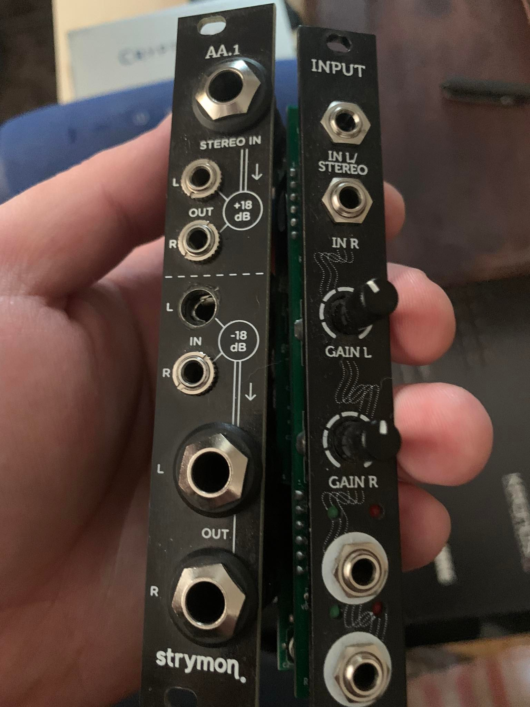
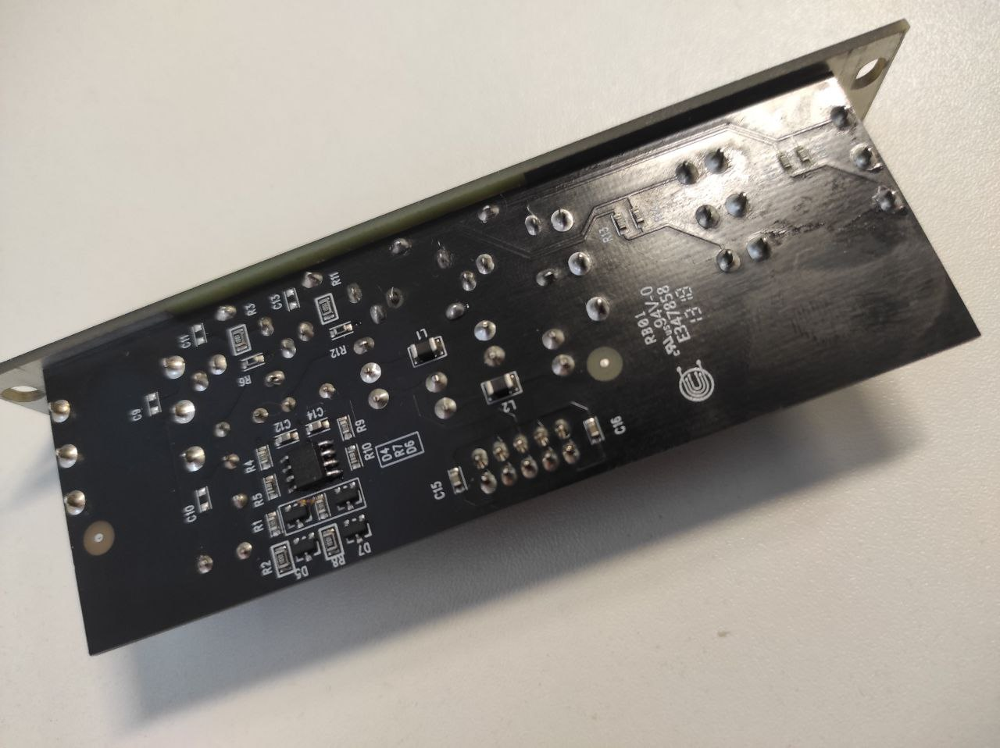

This will be my first post. I really-really enjoy electronics. It is something magical in process of fixing and building all those electronics things. As I am a musician and long-time-obsessed-with-music-guy, this type of work is a perfect match for me. So,

### Broken stuff - visual inspection

One of input jacks is definitely broken. It is not regular one,  so i tried to find subsittute- and yes! I found it locally. So replacing it.

Was a simple task, using braid and solder sucker. Butm, when turned on, i nmoticed that top part of module is not working completely.   

### Broken top part

Analyzed with DMM - see no action on ouputs at all. Next one was an op-amp, simple TL072. And yes, seems that is exactly the problem here - P-N juctions are shorted, according to diode mode on my DMM. Desoldering it and replacing with general style SOIC TL072.

I used general IC check technique - check diode junctions, like [here](https://www.youtube.com/watch?v=cGRPBV-_ZQc)

Working perfectly!

### Conclusion

I'm very satisfied with my first commercial-style fix (it's not my own module, and i was paid for this job which is amazing!). Simple but successful one.
