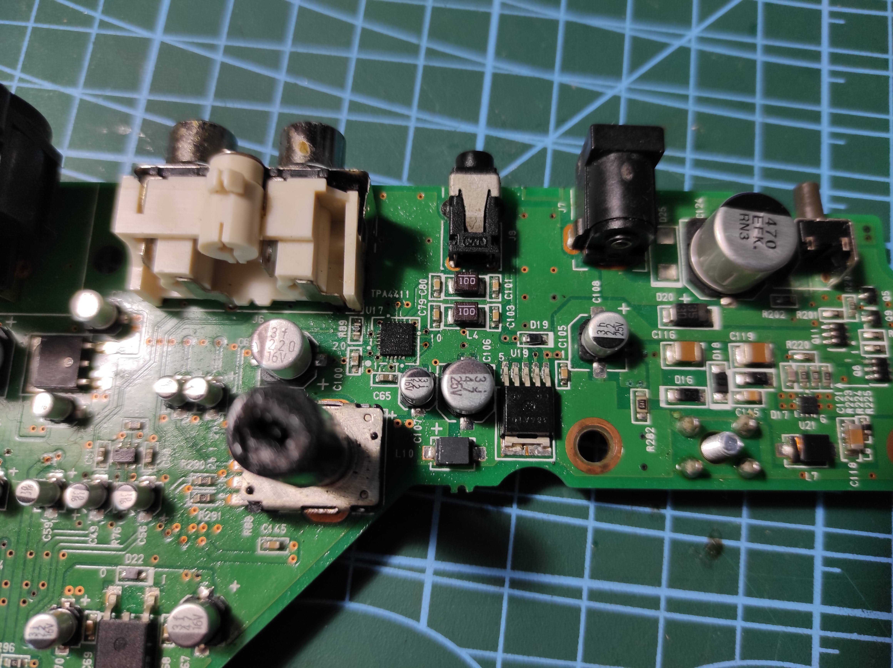
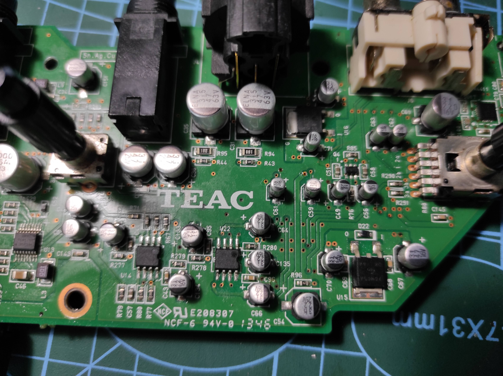
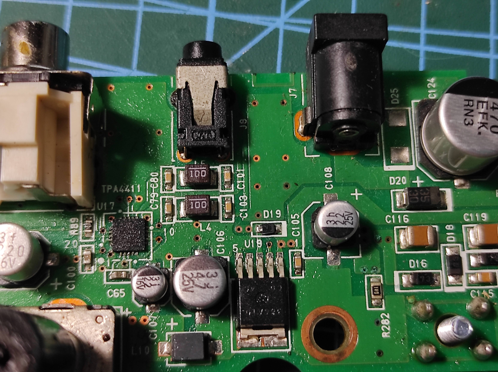
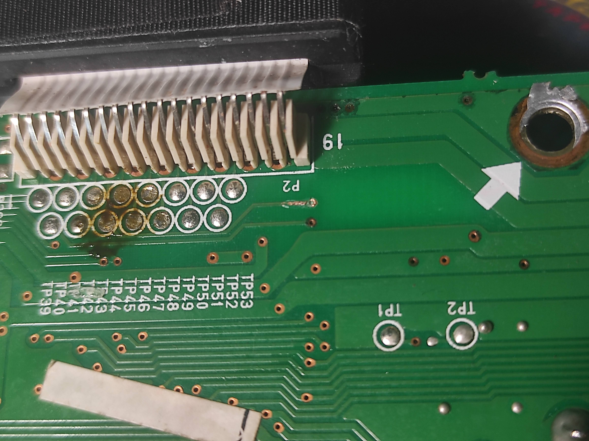

### Pre

That is probably the most complicated and big item which i repaired in whole electronics career. And im really-really happy with the result!

Internally it consists of 3 different boards - digital part, analog interfaces to outside world and "controls" board - sliding and rotarry pots, displa etc. It's packed firmly inside, so i had hard time disassembling and assembling it back - lots of effort and only photos of the whole process helped me to put it altogether while assembling.

### Problem

Device turned on, but no sound in headphones + glitches and accidental turn-off. Disassembling showed that something sticky was spoiled on control board... It dried long before, but traces of white grey and green in all types you can imagine showed that it was something with sugar!

Anyway, i had to completely clean all foil from elelectromagnetic shields first, i spend some time recreating foil loayer on plasting and cutting it all the same way it was there before. 

Happy accident was the fact that digital board was not affected at all; though, i had to replace some rusty linear and regular pots on control board.

### Phones

After assembling everything, headphones still not working completely. I traced whole signal path from jack to DAC - all worked fine; but, acidentally found out that dac to didgtal to analog board connector didn't ring! So i found that - due to rust, board trace was broked specifically at through-board connection. after Recreating with solder all worked perfectly well.

Amazing experience, 60 usd for device which costs 200+ usually - i'm very glad with this specific fix and will use it to record my modular