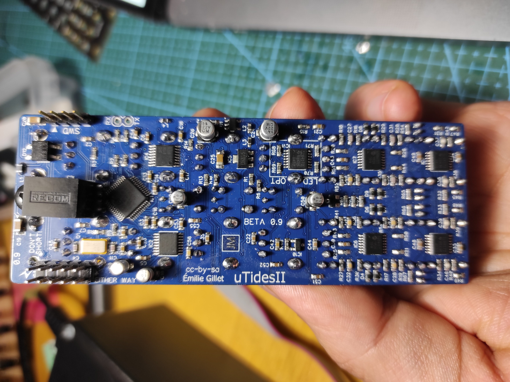
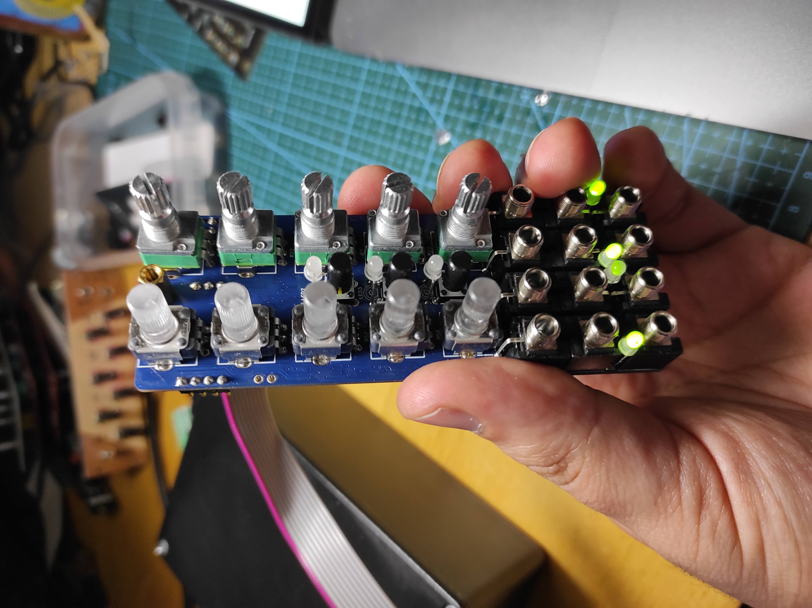

Two issues here: first, module was not burned, so i spent some time digging into MI dev environment setting up and firmware uploading process; went well of course.

Another small issue which i traced using schematic (thanks to ancient gods people adding schematic to those smd pcb reworks): one trace was cut just in the middle of its path. Weird, but this is probably quality of pcb.

Anyway - added piece of wire to solve this issue and all works amazingly well.

